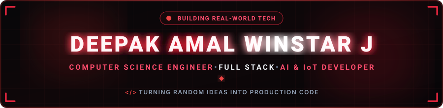

  

  

  
  
  
  
  
  

  

---

<h2 align="center">🔴 About Me</h2>

  

<table width="100%" border="0">
  <tr>
    <td width="58%" valign="top">
      <h3>⚡ Engineering Profile</h3>
      

        Hey! I'm <b>Deepak Amal Winstar J</b>, a passionate <b>Computer Science Engineering student & developer</b> based in India. I specialize in architecting scalable full-stack web platforms, integrating embedded IoT hardware, and deploying machine learning solutions to solve practical real-world problems.
      

      

        
        
        
      

      

        💬 <b>Let's Discuss:</b> Java, C++, JavaScript, React, Spring Boot, System Architecture & Git Workflows. 
        ⚡ <b>Philosophy:</b> <i>"I love turning random late-night thoughts into fully deployed production software!"</i>
      

    </td>
    <td width="42%" align="center" valign="middle">
      
    </td>
  </tr>
</table>

<table width="100%" border="0">
  <tr>
    <td width="25%" align="center" style="padding: 12px;">
      <h4>🔭 Flagship Project</h4>
      
<a href="https://opencore-mastitis-monitor.vercel.app/" target="_blank"><b>OpenCore Monitor</b></a> Dairy IoT & Anomaly Detection

    </td>
    <td width="25%" align="center" style="padding: 12px;">
      <h4>🌱 Active Deep Dives</h4>
      
<b>DSA &amp; Spring Boot</b> React Ecosystem &amp; System Design

    </td>
    <td width="25%" align="center" style="padding: 12px;">
      <h4>📱 Tech Creator</h4>
      
<a href="https://www.instagram.com/techwin.in/" target="_blank"><b>@techwin.in</b></a> Coding Guides &amp; Insights

    </td>
    <td width="25%" align="center" style="padding: 12px;">
      <h4>🤝 Collaboration</h4>
      
<b>AI, Web &amp; IoT</b> Open to exciting new projects

    </td>
  </tr>
</table>

---

<h2 align="center">🔴 Featured Project Spotlight</h2>

<table width="100%">
  <tr>
    <td align="center" style="padding: 20px;">
      <h3>🔬 OpenCore Mastitis Monitor</h3>
      
<i>A smart IoT & web-enabled dairy health monitoring system designed for early anomaly detection and real-time livestock welfare tracking.</i>

      

        
        &nbsp;
        
      

    </td>
  </tr>
</table>

---

<h2 align="center">🧩 LeetCode Problem Solving</h2>

<i>Live real-time tracker of coding challenges & algorithmic problem-solving milestones.</i>

  
    
  

    
    &nbsp;
    
  

---

<h2 align="center">🛠️ Tech Stack & Skills</h2>

<b>Core Programming Languages</b>

  

<b>Frontend & Mobile Development</b>

  

<b>Backend, Cloud & Databases</b>

  

<b>AI, Data Science, Hardware & DevOps</b>

  

  
  &nbsp;
  
  &nbsp;
  
  &nbsp;
  

---

<h2 align="center">📊 GitHub Analytics & Activity</h2>

  <table border="0">
    <tr>
      <td align="center">
        
      </td>
      <td align="center">
        
      </td>
    </tr>
  </table>

   

  

    

  

---

<h2 align="center">⚡ Contribution Journey</h2>

  

---

<h2 align="center">📬 Let's Connect &amp; Collaborate</h2>

<i>Whether you want to discuss system architecture, explore open-source collaboration, or just say hello — my inbox is always open!</i>

  <table border="0">
    <tr>
      <!-- LinkedIn -->
      <td align="center" width="220" style="padding: 16px;">
        <a href="https://www.linkedin.com/in/deepakamalwinstar/" target="_blank">
          
            
          
        </a>
         
        <b>Professional Network</b>
      </td>

      <!-- Instagram -->
      <td align="center" width="220" style="padding: 16px;">
        <a href="https://www.instagram.com/techwin.in/" target="_blank">
          
            
          
        </a>
         
        <b>Articles &amp; Tech Guides</b>
      </td>

      <!-- Email -->
      <td align="center" width="220" style="padding: 16px;">
        <a href="mailto:deepakamalwinstarj@gmail.com">
          
            
          
        </a>
         
        <b>Direct Collaboration</b>
      </td>
    </tr>
  </table>

  

